# 🍰 Whisk & Whimsy — Artisan Bakery Web Platform

A comprehensive, full-stack e-commerce platform for an artisan bakery. Features customer shopping flows, interactive cart drawers, a mock checkout & payment gateway, role-based authentication (Customer & Admin), and a dedicated Admin Dashboard with live analytics, order management, and full inventory control.

Built using React, Express, and PostgreSQL (Supabase).

---

## ✨ Key Features

### 🛍️ **Customer Experience**
* **Landing Page:** Interactive Home page featuring curated highlights, brand story, and promotional banners.
* **Dynamic Menu & Filters:** Paginated bakery menu with live category filtering, pricing filters, and instant title search.
* **Stock & Inventory Guard:** Real-time stock validation that disables buttons and caps quantity inputs once database limit (`stock_quantity`) is reached.
* **Slide-out Cart Drawer:** Slide-out panel with dynamic subtotaling, automated GST (5%) calculation, and item controls.
* **Product Details View:** Item-specific showcase with descriptions, stock badges, pricing, and image previews.
* **Mock Checkout & Payment:** Interactive dummy payment processing flow simulating order completion.

### 🛡️ **Authentication & Admin Dashboard**
* **Role-Based Auth:** Secure login and authentication flows for both Customers and Admins.
* **Analytics Dashboard:** Visual performance metrics tracking sales, total orders, and top-selling desserts.
* **Order Management:** Real-time order tracking and status management for incoming bakery orders.
* **Product & Inventory Management:** Complete CRUD system to create, update, delete, and toggle item availability in PostgreSQL.

---

## 📸 Screenshots & Showcase

### 🏠 1. Home Page & Menu
*Landing page showcasing fresh artisan pastries and the full paginated bakery menu.*

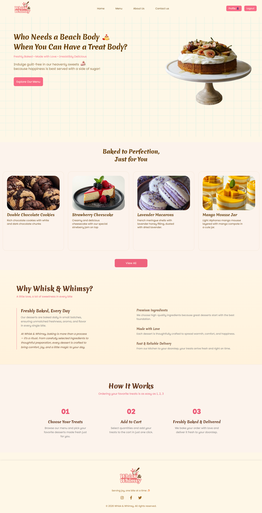
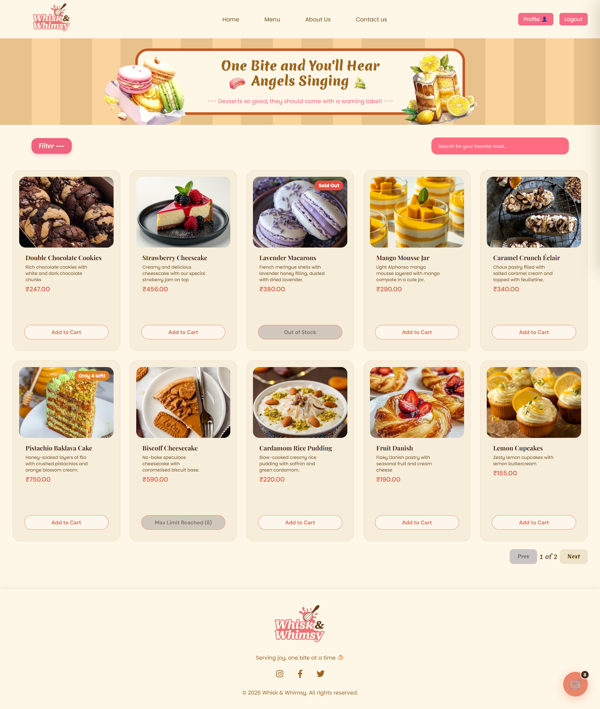

---

### 🛒 2. Cart Drawer & Product Details
*Slide-out cart drawer with live tax calculations and dedicated item detail pages.*

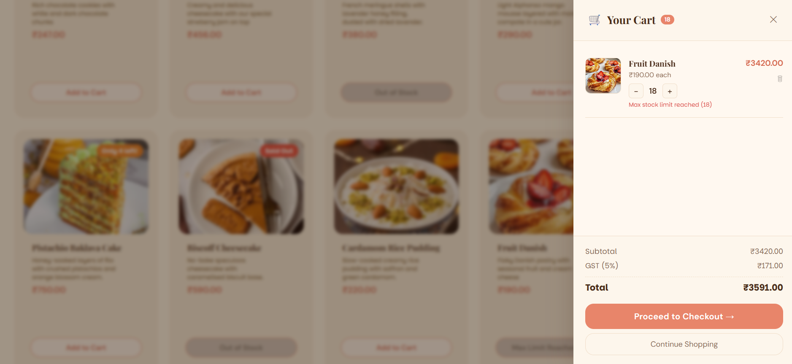
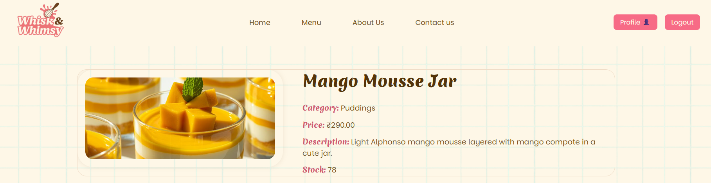

---

### 💳 3. Checkout & Mock Payment Page
*Interactive dummy checkout form simulating payment verification and order confirmation.*

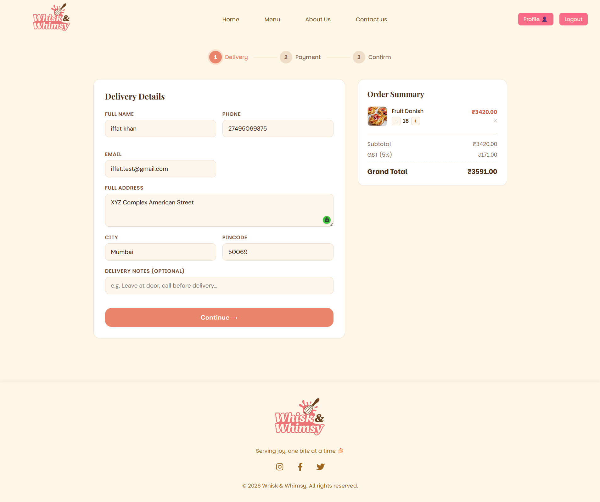
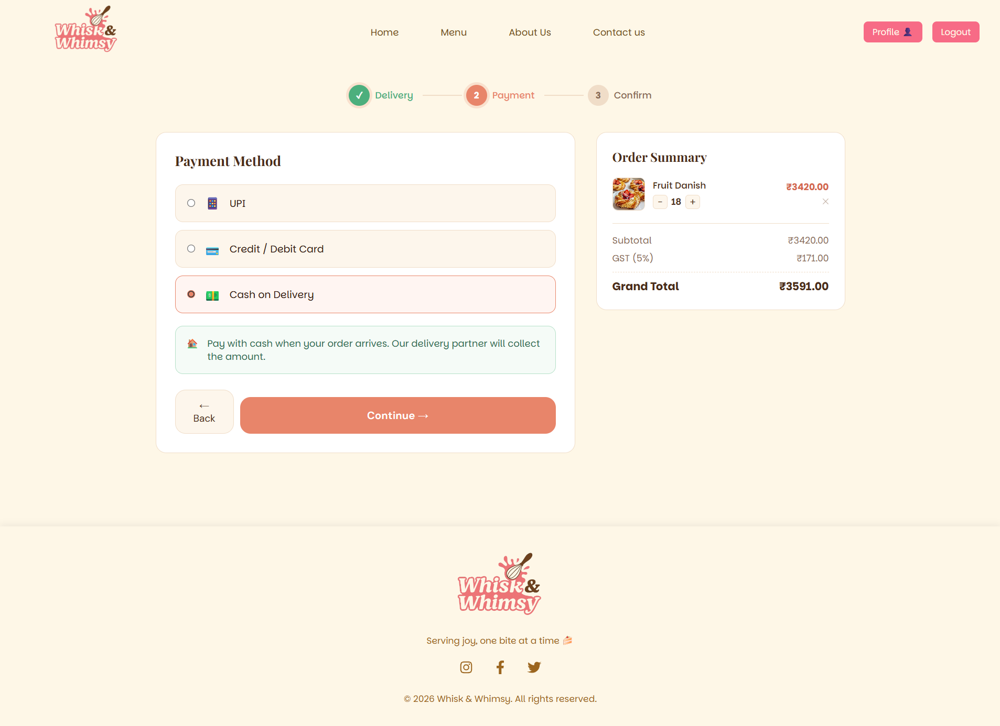
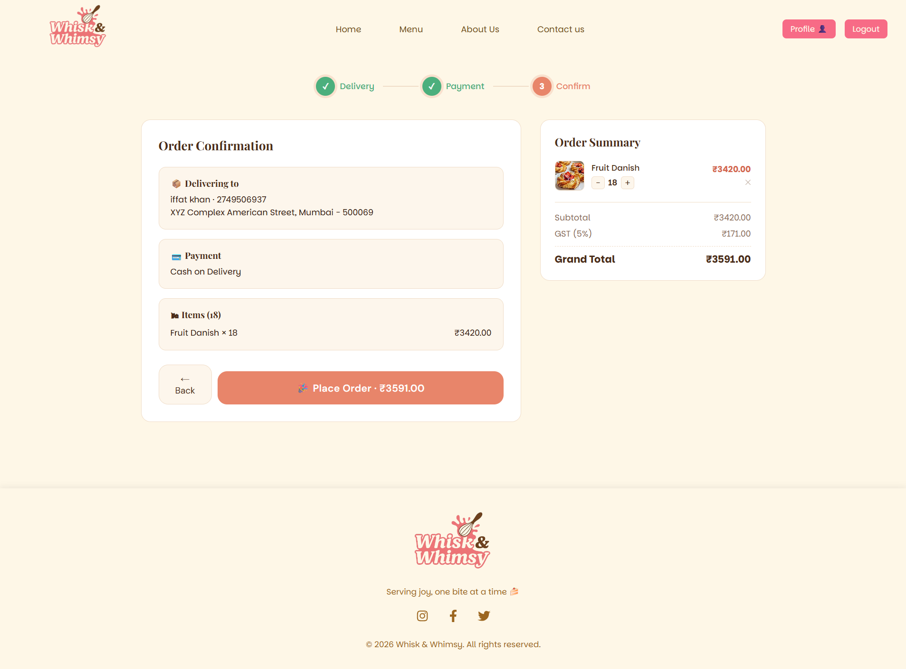
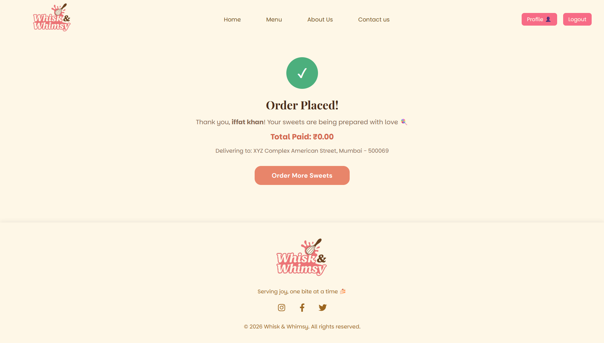
---

### 📊 4. Admin Analytics & Product Dashboard
*Comprehensive dashboard displaying sales analytics, recent customer orders, and product CRUD tools.*

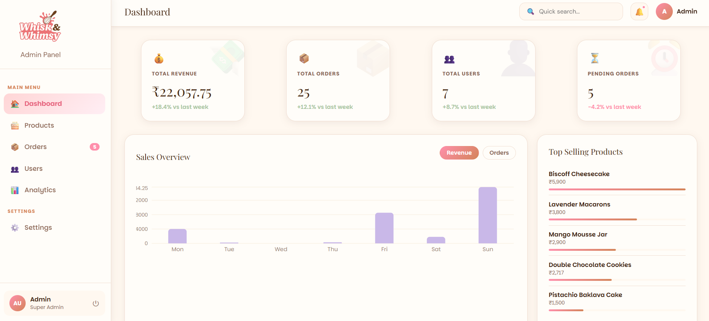
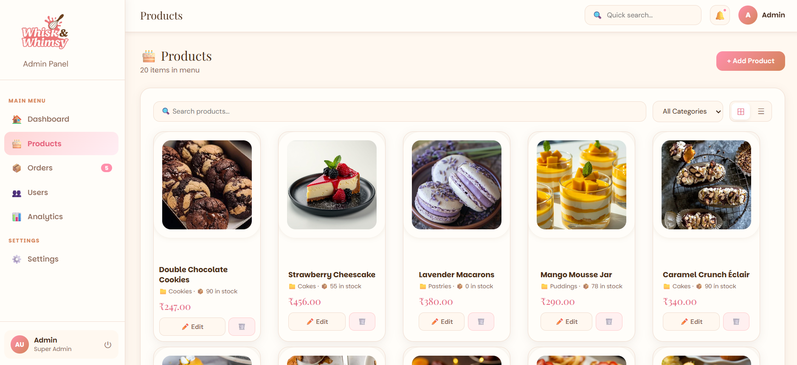
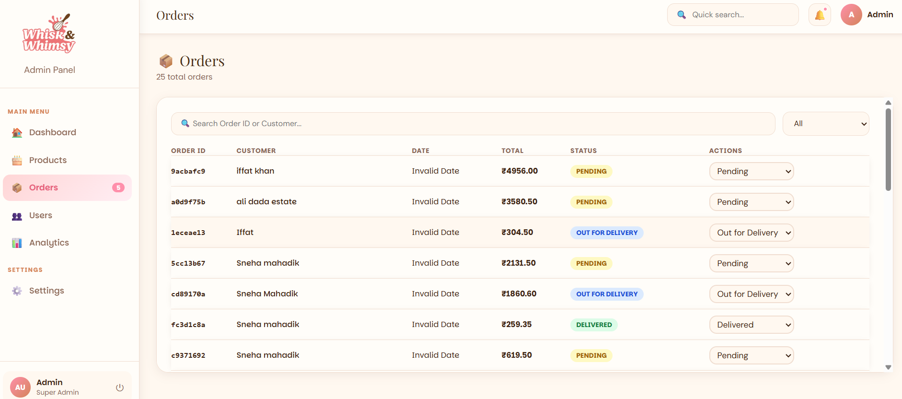
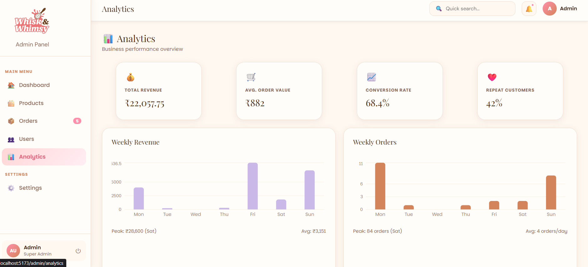

---

## 🛠️ Tech Stack

### **Frontend**
* **Framework:** React.js (Vite)
* **Routing:** React Router v6
* **State & Context:** React Context API (Cart State, Auth Context)
* **HTTP Client:** Axios
* **Styling:** Custom Modular CSS3 with Flexbox & CSS Grid

### **Backend**
* **Server:** Node.js & Express.js
* **Database:** PostgreSQL (hosted via Supabase)
* **Database Driver:** `pg` (node-postgres) with parameterized queries
* **Environment Management:** `dotenv`

---

## 📁 Project Structure

```text
Whisk-and-Whimsy/
├── backend/
│   ├── config/          # PostgreSQL database pool configuration
│   ├── controllers/     # Route handlers (Products, Orders, Admin Analytics, Auth)
│   ├── middleware/      # Error handling & authentication check middleware
│   ├── routes/          # Express API route endpoints
│   └── server.js        # Main Express backend server
│
├── frontend/
│   ├── src/
│   │   ├── components/  # Reusable UI (Navbar, Footer, CartDrawer, MenuCards)
│   │   ├── context/     # CartContext & AuthContext
│   │   ├── pages/       # Home, Menu, ProductDetails, Checkout, AdminDashboard, Login
│   │   └── styles/      # Modular stylesheets
│   └── App.jsx          # React router setup
│
└── README.md